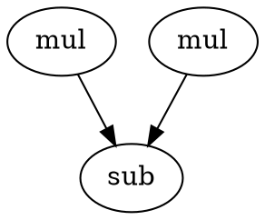

# Operator Scheduling

## Background

High-level synthesis (HLS) is an important stage in electronic design automation (EDA), aimed at translating a high-level program specification (e.g., written in C/C++ or SystemC) into a cycle-accurate hardware implementation. After the program is parsed and analyzed, it is typically transformed into an intermediate representation known as a Control Data Flow Graph (CDFG). This graph captures the operations (e.g., arithmetic, memory accesses) and their control/data dependencies. The CDFG can further be processed into a Directed Acyclic Graph (DAG) to facilitate scheduling and optimization.

One of the core challenges in HLS is operator scheduling, which determines the exact control step (or cycle) at which each operation is executed, while satisfying data dependencies and resource constraints. Efficient scheduling plays a critical role in optimizing design quality in terms of performance, area, and power.

## Formalization

Consider a CDFG with $n$ operation nodes $o_i$, where $i \in O = \{1, 2, \ldots, n\}$, and a precedence relation $\prec$ on $O$ that captures operation dependencies. Each operation $o_i$ is associated with a cycle delay $d_i \in \mathbb{Z}^+$ and a resource type $r_i \in R = \{1, 2, \ldots, k\}$. Let $T = \{1, 2, \ldots, L\}$ represent the set of control steps (c-steps), and define a schedule as an $n$-tuple $s = (t_1, t_2, \ldots, t_n)$, where $t_i \in T$ denotes the start time (c-step) of operation $o_i$.

A schedule $s$ is feasible if it satisfies all data dependencies:  
$\forall i, j \in O: i \prec j \Rightarrow t_i + d_i \leq t_j$.  
Let $S$ denote the set of all feasible schedules. For a given schedule $s$, let $N_r(t)$ be the number of operations that use resource $r$ in control step $t$, and define the total usage of resource $r$ as $N_r = \sum_{t \in T} N_r(t)$.

## Objective

Given a bound $G_r$ on the number of available instances for each resource type $r \in R$, the operator scheduling problem is to find a feasible schedule $s \in S$ that minimizes the overall latency $L$, defined as  
$\min_{s \in S} \max_{i \in O} (t_i + d_i)$,  
subject to the resource constraints  
$\forall r \in R, t \in T: N_r(t) \leq G_r$.

## Input Format
The input graph is stored in DOT format as shown below. Each node is represented as `<node> [label = <resource>]`, and each edge is defined as `<src node> -> <dst node> [name = <name>]`:



A separate JSON file specifies the execution delay and the number of available functional units for each type of resource:
```json
{
    "delay": {
        "mul": 3,
        "sub": 1
    },
    "resource": {
        "mul": 2,
        "sub": 1
    }
}
```

## Output Format
The output should provide the execution schedule of the program, indicating the start cycle of each operation. For example, the following output means that `n1` and `n2` start at cycle 0, while `n3` starts at cycle 3:
```
n1:0
n2:0
n3:3
```

## References
1. Jason Cong, Zhiru Zhang, "An Efficient and Versatile Scheduling Algorithm Based on SDC Formulation", Design Automation Conference (DAC), 2006.
2. Minghua Shen, Hongzheng Chen, Nong Xiao, "Entropy-Directed Scheduling for FPGA High-Level Synthesis", IEEE Transactions on Computer Aided Design of Integrated Circuits & Systems (TCAD), 2020.
3. https://web.ece.ucsb.edu/EXPRESS/benchmark/
